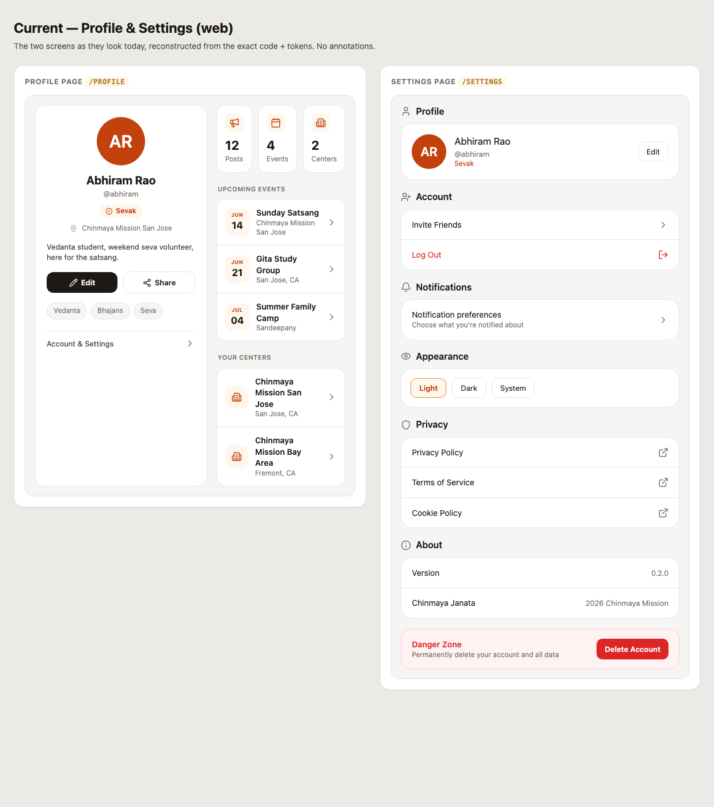
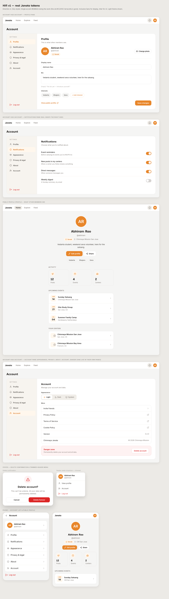

# Design spec — Profile + Settings → Account hub (web/desktop)

**Session:** `~/.gstack/projects/Project-Janatha-Project-Janatha/refine/20260606-091019-profile-settings`
**Platform:** web-static — expo-router `.web.tsx`, React Native Web (responsive; desktop primary)
**Status:** approved through hifi · 2026-06-06
**Source of truth for visuals:** `hifi/mock-v1.html` (when a value is ambiguous below, match the mock).

---

## 1. Summary

The account surface today is split across **three overlapping places** (the profile card's "Account & Settings" link, the `/settings` page, and the header avatar dropdown) with the user's identity rendered twice and a settings page that is mostly a "list of doors". The redesign (IA Direction A) consolidates it:

- **One Account hub** at a single route with a **left rail** (Profile · Notifications · Appearance · Privacy & legal · About · Account) and **in-page panes** — one section shows at a time, the rail persists. No sub-routes; section is component state. Log out is pinned at the bottom of the rail.
- **Identity de-duplicated.** The full identity card is removed from settings; the hub's Profile pane is an **inline editor** (name, photo, bio, interests edited in place — no bounce to `/edit-profile`).
- **Public profile stays its own clean page** (`/profile`) — the thing other members see: identity → Edit/Share → Activity (stats, events, centers) demoted below. Reached from the editor via "View public profile".
- **Settings become real controls**, not links: Notifications is inline toggles; Appearance is the theme segment.
- **Token drift fixed** — single accent `#E8862A` everywhere (drop the hardcoded `#C2410C` terracotta in `profile.web.tsx`); borders use token `#E7E5E4` (drop the `#ECE7DE` hardcode in settings).
- **Header dropdown trimmed** to View profile · Account · Log out.

Behavioral wins (clicks from app home): edit bio 3→2, notification prefs 4→3, no duplicate identity, one home for settings.

---

## 2. Before / after






- **Before:** `./01-before.png` — note the two oranges, the identity shown on both screens, and the 7-section low-density settings scroll.
- **After:** `./04-hifi.png` — one accent, two-pane hub, inline editor, calm public profile.

---

## 3. Approved IA tree

```
Public Profile  /profile  (what others see)
├─ Identity              blk-01 copy-01 copy-02 blk-02 blk-03 copy-03
├─ Interests             blk-04
├─ Owner actions         act-01(Edit→hub) act-02(Share)
└─ Activity (secondary)  blk-05 blk-06 blk-07
                         copy-04 blk-08 (state-02/act-04 empty)
                         copy-05 blk-09 (state-03/act-05 empty)

Account hub  /account  (single route, in-page panes)
├─ Left rail             copy-06 Profile · copy-08 Notifications · copy-09 Appearance
│                        copy-10 Privacy & legal · copy-11 About · copy-07 Account
│                        act-08 Log out (pinned bottom)
├─ Profile pane          new-02 inline editor (new-04 change photo, new-06 add interest,
│                        new-05 save), state-01 empty bio, new-01 view public profile
├─ Notifications pane    nav-03 → new-03 inline toggles
├─ Appearance pane       form-01 theme segment
├─ Privacy & legal pane  nav-04 nav-05 nav-06
├─ About pane            blk-11 blk-12
└─ Account pane          nav-02 invite · blk-13 danger zone · act-09 → mod-01 (act-10/act-11)

Header avatar dropdown (trimmed)   nav-07: View profile · Account · Log out
```

---

## 4. Change table

| ID | Label | Verdict | From | To |
|----|-------|---------|------|----|
| blk-01 | Profile avatar | keep | profile.web.tsx:96 | Public profile, centered top |
| copy-01 | Display name | keep | profile.web.tsx:103 | Public profile + editor field |
| copy-02 | @username | keep | profile.web.tsx:104 | Public profile + editor |
| blk-02 | Role badge | keep (recolor) | profile.web.tsx:105 | Both; **accent `#E8862A`**, not `#C2410C` |
| blk-03 | Home center line | keep | profile.web.tsx:111 | Public profile identity |
| copy-03 | Bio | keep | profile.web.tsx:119 | Public profile + editor textarea |
| state-01 | Empty bio hint | keep | profile.web.tsx:122 | Editor hint under Bio field |
| act-01 | Edit | move | profile.web.tsx:128 | Public profile primary btn → **opens hub Profile pane** (was `/edit-profile`) |
| act-02 | Share | keep | profile.web.tsx:132 | Public profile secondary btn |
| blk-04 | Interest tags | keep | profile.web.tsx:138 | Public profile (read) + editor (editable) |
| nav-01 | "Account & Settings" link | **merge → nav-07** | profile.web.tsx:148 | Removed from profile; replaced by header menu "Account" + act-01 routing into hub |
| blk-05/06/07 | Stat cards Posts/Events/Centers | keep (recolor) | profile.web.tsx:173-175 | Public profile "Activity"; icons accent |
| copy-04 | "Upcoming events" label | keep | profile.web.tsx:178 | Public profile |
| blk-08 | Upcoming events list | keep | profile.web.tsx:179 | Public profile |
| state-02 | Empty events + Explore CTA | keep | profile.web.tsx:204 | Public profile empty state (see §7) |
| act-04 | Explore events CTA | keep | profile.web.tsx:212 | Inside state-02 |
| copy-05 | "Your centers" label | keep | profile.web.tsx:218 | Public profile |
| blk-09 | Your centers list | keep | profile.web.tsx:219 | Public profile |
| state-03 | Empty centers + Find CTA | keep | profile.web.tsx:238 | Public profile empty state (see §7) |
| act-05 | Find a center CTA | keep | profile.web.tsx:247 | Inside state-03 |
| blk-10 | Settings duplicate identity card | **cut → merge new-02** | settings/index.web.tsx:99 | Folded into hub Profile pane editor |
| act-06 | Settings "Edit" button | **cut** | settings/index.web.tsx:125 | Replaced by inline editing (new-02) |
| copy-06 | "Profile" header | keep | settings/index.web.tsx:97 | Rail nav item |
| copy-07 | "Account" header | keep | settings/index.web.tsx:140 | Rail nav item / Account pane |
| nav-02 | Invite Friends | keep | settings/index.web.tsx:151 | Account pane row |
| act-08 | Log Out | move | settings/index.web.tsx:168 | Rail bottom (pinned) + Account pane |
| copy-08 | "Notifications" header | keep | settings/index.web.tsx:187 | Rail nav item |
| nav-03 | Notification preferences | move→inline | settings/index.web.tsx:189 | Notifications pane — **inline toggles (new-03)**, no subpage |
| copy-09 | "Appearance" header | keep | settings/index.web.tsx:217 | Rail nav item |
| form-01 | Theme selector | keep | settings/index.web.tsx:228 | Appearance pane (segmented) |
| copy-10 | "Privacy" header | keep | settings/index.web.tsx:236 | Rail nav item "Privacy & legal" |
| nav-04 | Privacy Policy | keep | settings/index.web.tsx:247 | Privacy & legal pane |
| nav-05 | Terms of Service | keep | settings/index.web.tsx:264 | Privacy & legal pane |
| nav-06 | Cookie Policy | keep | settings/index.web.tsx:281 | Privacy & legal pane |
| copy-11 | "About" header | keep | settings/index.web.tsx:303 | Rail nav item |
| blk-11 | Version row | keep | settings/index.web.tsx:314 | About pane |
| blk-12 | Copyright row | keep | settings/index.web.tsx:329 | About pane |
| blk-13 | Danger Zone card | keep | settings/index.web.tsx:346 | Account pane |
| act-09 | Delete Account | keep | settings/index.web.tsx:367 | Account pane → mod-01 |
| mod-01 | Delete confirm modal | keep | settings/index.web.tsx:380 | Unchanged behavior |
| act-10 | Cancel (modal) | keep | settings/index.web.tsx:443 | Modal |
| act-11 | Delete Forever | keep | settings/index.web.tsx:451 | Modal |
| nav-07 | Header avatar dropdown | move/trim | components/settings/SettingsPanel.tsx:168 | Trimmed to View profile · Account · Log out |
| new-01 | "View public profile" link | **add** | — | Profile pane savebar |
| new-02 | Inline profile editor | **add** | — | Profile pane (absorbs blk-10) |
| new-03 | Notification toggles (inline) | **add** | — | Notifications pane (event reminders, center posts, DMs, weekly digest) |
| new-04 | "Change photo" button | **add** | — | Profile pane id row |
| new-05 | "Save changes" button | **add** | — | Profile pane savebar |
| new-06 | "+ Add interest" chip | **add** | — | Profile pane interests |

**Accounting:** all 45 inventory IDs resolved (keep/move 41, cut 2 [blk-10, act-06], merge 1 [nav-01→nav-07], plus state/empty kept). 6 adds (new-01..06). No silent drops.

---

## 5. Copy table

| ID | Old | New | Where |
|----|-----|-----|-------|
| copy-06 | "Profile" (section header) | "Profile" | Rail nav (unchanged) |
| copy-10 | "Privacy" | "Privacy & legal" | Rail nav (broadened — folds About-adjacent legal) |
| new (pane sub) | — | "This is what other members see." | Profile pane subhead `NEW-COPY` |
| state-01 | "No bio yet — tap Edit to introduce yourself." | "No bio yet — introduce yourself." | Editor hint (Edit is implicit now) `NEW-COPY` |
| nav-03 | "Notification preferences" / "Choose what you're notified about" | "Notifications" + "Choose what you're notified about." | Notifications pane head `NEW-COPY` |
| new-03 | — | "Event reminders" / "New posts in my centers" / "Direct messages" / "Weekly digest" + helper lines | Toggle rows `NEW-COPY` |
| new-04 | — | "Change photo" | Editor `NEW-COPY` |
| new-05 | — | "Save changes" | Editor `NEW-COPY` |
| new-01 | — | "View public profile" | Editor link `NEW-COPY` |
| act-01 | "Edit" | "Edit profile" | Public profile `NEW-COPY` |

All other copy carries over verbatim from the inventory.

---

## 6. Redlines (from `hifi/tokens.json`; match `hifi/mock-v1.html`)

**Colors (light):** bg `#F5F5F4` · card/rail `#FFFFFF` · panel (rail bg) `#F7F4EF` · border `#E7E5E4` · divider `#F1ECE3` · text `#1C1917` · text2 `#44403C` · muted `#78716C` · faint `#A8A29E` · **accent `#E8862A`** · accentPress `#D97520` · accentSoft `#FFF7ED` · error `#DC2626` · errorSoft `#FEF2F2`. Dark theme: use the existing `DARK` palette in `tokens/colors.ts` (already correct).

**Type:** Inclusive Sans (display) — hub heading 24/700, pane h2 20/700, profile name 26/700. Inter (UI) — body 14-15, labels 12.5/600, helper 12.5 muted.

**Radii:** hub container & cards 20 · stat cards 16 · list cards 16 · buttons/inputs 12 · nav item 10 · pills 999.

**Spacing:** rail width 248, rail padding 16/12, nav item 10×12 with 11 gap to icon; pane padding 30×34; field gap (label→input) 7, section gap ~18-22.

**Components:** primary button = accent fill, white text, radius 12, 11×18 pad. Outline button = card bg + 1.5px border. Toggle ON = accent. Active nav = accentSoft bg + accentPress text + accent icon. Role badge = accentSoft bg + accentPress text + accent BadgeCheck (NOT terracotta). Inputs focus = accent border + 3px `rgba(232,134,42,.13)` ring. Icons = Lucide (`user, bell, eye, shield, info, user-plus, log-out, pencil, share-2, badge-check, map-pin, megaphone, calendar-days, building-2, external-link, alert-triangle, camera, chevron-right, sun, moon, monitor`).

---

## 7. States

- **state-01 empty bio** — editor shows placeholder + hint "No bio yet — introduce yourself."; public profile omits the bio block when empty.
- **state-02 empty events** — when no upcoming events, blk-08 list is replaced by a centered empty card: CalendarDays-in-accentSoft, "No upcoming events yet", body "RSVP to satsangs, study groups, and events near you — they'll show up here.", **act-04** "Explore events" → `/explore` (accent pill).
- **state-03 empty centers** — Building2 empty card, "No center yet", body "Find your Chinmaya center to connect with your local community.", **act-05** "Find a center" → `/explore`.
- **New member (all-empty)** — stats show 0; both empty cards stack. Acceptable; no special combined state required.
- **mod-01 delete** — unchanged: confirm dialog, Cancel (act-10) / Delete forever (act-11, error fill); on success → `/auth`.

---

## 8. Acceptance criteria

- [ ] Account hub is a single route with in-page panes; left rail persists, one pane visible at a time; log out pinned at rail bottom.
- [ ] The identity editor is inline (name, photo via new-04, bio, interests via new-06, save via new-05) — no navigation to `/edit-profile`.
- [ ] The duplicate identity card (blk-10) and its Edit button (act-06) are gone from settings.
- [ ] Notifications pane renders inline toggles (new-03); no separate notifications subpage in the hub flow.
- [ ] Public profile (`/profile`) shows identity → Edit profile (act-01) / Share (act-02) → Activity (stats, events, centers) below; Edit opens the hub Profile pane.
- [ ] Header avatar dropdown (nav-07) is trimmed to View profile · Account · Log out.
- [ ] **No `#C2410C` remains** in `profile.web.tsx`; accent is token `#E8862A`. Borders use `#E7E5E4` (no `#ECE7DE`).
- [ ] Edit-bio reachable in ≤2 clicks from app home; notification prefs in ≤3.
- [ ] Empty states (state-02, state-03) implemented per §7.
- [ ] Every change-table row implemented; nothing in the table left as a no-op.
- [ ] Dark theme works (uses `DARK` tokens; no hardcoded light hexes).

---

## 9. Out of scope / deferred

- Sub-route URLs per section (decided: single `/account` route, in-page panes).
- AI concept image (declined).
- Notification backend wiring for the new toggle rows (DMs / weekly digest) — the toggles are specced; persisting them is a follow-up if the prefs API doesn't already cover them.
- Native (`.tsx`) parity beyond the web target — this spec is the web/desktop surface; mirror the same IA to native in a follow-up.
